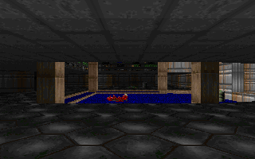

# pyDOOM

A **Python reimplementation of the DOOM engine** (based on
[linuxdoom-1.10](https://github.com/id-Software/DOOM)), targeting
registered Doom 1: **E1M1–E3M9, completable end to end**, as
faithfully as reasonable — with documented simplifications wherever
the original would cost more than it gives.



```sh
pip install -r requirements.txt   # needs DOOM1.WAD (or doom.wad) next to the project root
python tools/doom_view.py         # title screen -> ESC -> New Game
python tools/doom_view.py --debug # with developer keys
```

## Goal

Recreate the original engine as closely as possible (fixed-point math,
BSP renderer, thinkers, RNG streams, linedef/sector specials, GENMIDI
music), while allowing pragmatic divergences where they simplify the
work without changing how the game feels. Every deliberate deviation
is marked with a `NOTE:` comment at the point of divergence.

## Current state

| Area | Status |
|---|---|
| Software renderer (320×200, BSP, visplanes, masked sprites, fuzz, sky) | done |
| OpenGL renderer (native res, palette-index shaders, `--video-api=opengl`, auto-fallback) | done |
| Physics (clip/slide, lifts, stairs, crushers, teleports) | done |
| Combat, full Doom 1 bestiary AI, per-episode boss deaths | done |
| All E1–E3 line/sector specials, keys, secret exits | done |
| Weapons 1–7, status bar, animated face, palette flashes | done |
| OPL music (MUS + GENMIDI → OPL2 @22050, stereo) + full SFX @44100 | done |
| Title, menu, intermission tally, finale, save/load, wipes | done |
| Skill levels (incl. nightmare/fast/respawn), cheats | done |
| Vanilla demo compat (.lmp playback/record, attract loop) | experimental, off by default (`demos 1` in pydoom.cfg) |
| E2/E3 finale texts, E3 bunny scroll + cast call | todo |
| Infrared/allmap as real renderer effects | todo |
| Doom 2, multiplayer | out of scope |

`489` pytest tests green (`python -m pytest tests/`).
Deliberate simplifications are catalogued in
[`docs/DIVERGENCES.md`](docs/DIVERGENCES.md).

## Controls

Move `WASD`/arrows, mouse look, `Shift` run · `E` use · `1–7` weapons ·
`TAB` automap · `M` sound · `ESC` menu. Typed cheats always work, like
vanilla: `iddqd` `idkfa`/`idfa` `idclip` `idclev`/`idmus` (E1M1–E3M9)
`iddt` `idbehold…` `idmypos` `idchoppers`.

`--debug` unlocks developer keys: `N` noclip, `F` freeze AI, `X` AI
readout, `PgUp`/`PgDn` map hop, `G` mouse grab.

## Video settings

Backend + size are picked in the launcher VIDEO tab (fresh boot, no
risk) and stay fixed in-game; Options → Video tunes the live-safe rows
(staged, APPLY commits, saved to `pydoom.cfg`):
backend (software/OpenGL), GL resolution (640×400 … 1920×1200),
software window scale (100/200/300% of 320×200), fps limit
(30–240/Unlimited), VSync, display (windowed/fullscreen-exclusive on
Windows only/borderless), target screen (fullscreen/borderless follow
it instead of the window manager's pick), FPS readout. Software always renders
320×200 and letterboxes fullscreen sizes with black bars; OpenGL
renders natively (16:9 fullscreen widens the view like widescreen
source ports).

## CLI

```
python tools/doom_view.py [MAP] [WAD] [--skill=baby|easy|normal|hard|nightmare]
    [--fast] [--debug] [--frames=N] [--record=FILE] [--play=FILE]
```

## Layout

- `pydoom/` — the engine (`renderer`, `physics`, `ai`, `combat`,
  `doors`, `weapons`, `audio`, `oplmusic`, `menu`, …)
- `tools/doom_view.py` — playable viewer (the game shell)
- `tools/render_frame.py` — headless single-frame renderer
- `tests/` — regression suite (engine behavior, vanilla cross-checks)
- `DOOM1.WAD` — shareware IWAD (only episode 1, like the 1993 floppy)

## Requirements

Python ≥ 3.10, `numpy`, `pygame-ce`, `numba`, `pytest`.
`PyOPL` is optional: without it the game runs silently, like vanilla
LinuxDoom without its MUS server.
`PyOpenGL` enables the OpenGL renderer (`--video-api=opengl`);
`PyOpenGL_accelerate` is its optional C speed-up (the pure-Python
core is all the code needs). Without them the viewer auto-falls back
to the software raster, like headless CI does.

## Acknowledgments

- [id Software](https://github.com/id-software/doom) for the original
  DOOM engine — this project is an independent clean-room-style port
  for learning and preservation.
- [dsda-doom](https://github.com/kraflab/dsda-doom) by kraflab,
  consulted for the OpenGL renderer design (`gl_main`/`gl_preprocess`
  model).
- [Chocolate Doom](https://github.com/chocolate-doom/chocolate-doom),
  consulted as behavior reference (demo compat, statdump cross-checks).

## License

GPL-3.0-or-later (see `LICENSE`). Original engine by id Software;
this reimplementation is an independent clean-room-style port for
learning and preservation.

---
*Project created with [opencode](https://opencode.ai) agent **Muse Spark 1.3**.*
